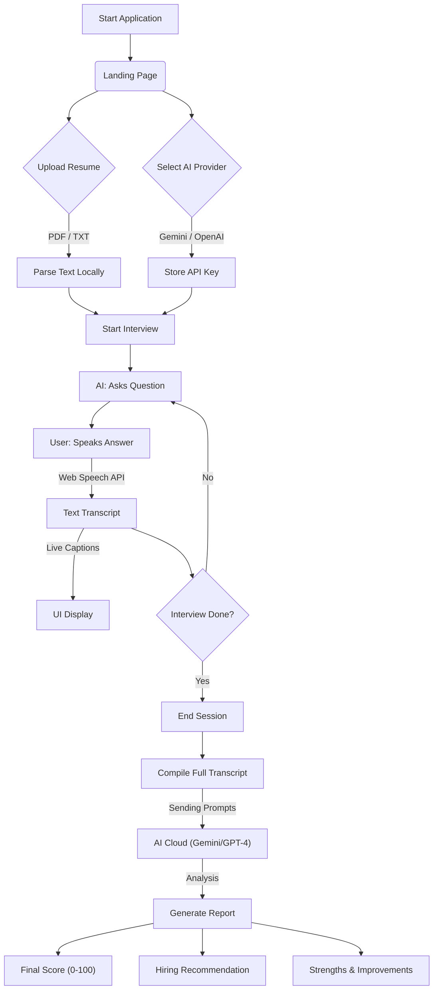

# Interview Guru 🎓

**Master your next job interview with an AI-powered coach.**

Interview Guru is a modern, voice-interactive web application that simulates a real job interview. Upload your resume, and our AI agent will generate context-aware questions, listen to your spoken answers, and provide a comprehensive hiring report with actionable feedback.


## ✨ Features


- **🧙‍♂️ Guru Mode**: Immersive Indian Tech Guru avatar with holographic visuals and conversational AI that feels alive.
- **⚡ Real-Time Adaptive AI**: The interviewer reacts to your specific answers in real-time, asking relevant follow-ups instead of a static script.
- **🎯 Job-Specific Training**: Paste a job description and role to get a tailored interview experience (e.g., "Senior React Dev").
- **🌌 Dynamic Visuals**: Interactive particle constellations, typewriter effects, and glassmorphism UI.
- **📄 Smart Resume Parsing**: Drag & drop your PDF or TXT resume. The app analyzes it entirely in your browser.
- **🗣️ Voice-First Interaction**: Hands-free experience using Web Speech API. The AI speaks to you, and you speak back.
- **📝 Real-Time Captions**: See exactly what the AI hears as you speak with live confidence monitoring.
- **🤖 Dual AI Engine**: Support for both **Google Gemini** (Flash/Pro) and **OpenAI GPT-4**.
- **📊 Detailed Analytics**:
  - **Hiring Score (0-100)** based on industry standards.
  - **Hire / No Hire** recommendation.
  - **Strengths & Weaknesses** breakdown.
  - **Behavioral & Technical** assessment.
- **🎨 Premium UI**: Glassmorphism design, dark mode, and fluid animations for a stress-free environment.


## 🔄 Architecture & Workflow

Here is the high-level logic flow of the Interview Guru application:



## 🚀 Getting Started

No installation or complex build steps required. This is a pure standard web application.

### Prerequisites

- A modern browser (Chrome, Edge, or Safari recommended for best Voice support).
- A valid API Key for **Google Gemini** OR **OpenAI**.

### Running Locally

1. **Clone the repository**:
   ```bash
   git clone https://github.com/Meet-Amin/Interview-Guru.git
   cd Interview-Guru
   ```

2. **Start a local server**:
   Since the app uses ES Modules and Audio APIs, it must be served over HTTP (opening `index.html` directly won't work).

   **Python**:
   ```bash
   python3 -m http.server 8000
   ```
   **Node.js**:
   ```bash
   npx serve
   ```

3. **Open in Browser**:
   Visit `http://localhost:8000`

## 🔑 AI Configuration

To get the "100% Accurate" reports, you need to connect an AI provider. Your privacy is respected; keys are stored only in memory and never sent to our servers.

1. **Google Gemini (Recommended)**
   - Get a free key from [Google AI Studio](https://aistudio.google.com/app/apikey).
   - Supports: `gemini-1.5-flash`, `gemini-1.5-pro`, `gemini-1.0-pro`.

2. **OpenAI**
   - Get a key from [OpenAI Platform](https://platform.openai.com/).
   - Supports: `gpt-4`, `gpt-3.5-turbo`.

## 🛠️ Technology Stack

- **Frontend**: HTML5, CSS3 (Variables, Flexbox/Grid), Vanilla JavaScript (ES6+).
- **Audio**: Web Speech API (SpeechRecognition & SpeechSynthesis).
- **PDF Processing**: `pdf.js` (Mozilla).
- **Styling**: Custom Glassmorphism CSS system.

## 🤝 Contributing

Contributions are welcome! Please feel free to submit a Pull Request.

1. Fork the project
2. Create your feature branch (`git checkout -b feature/AmazingFeature`)
3. Commit your changes (`git commit -m 'Add some AmazingFeature'`)
4. Push to the branch (`git push origin feature/AmazingFeature`)
5. Open a Pull Request

